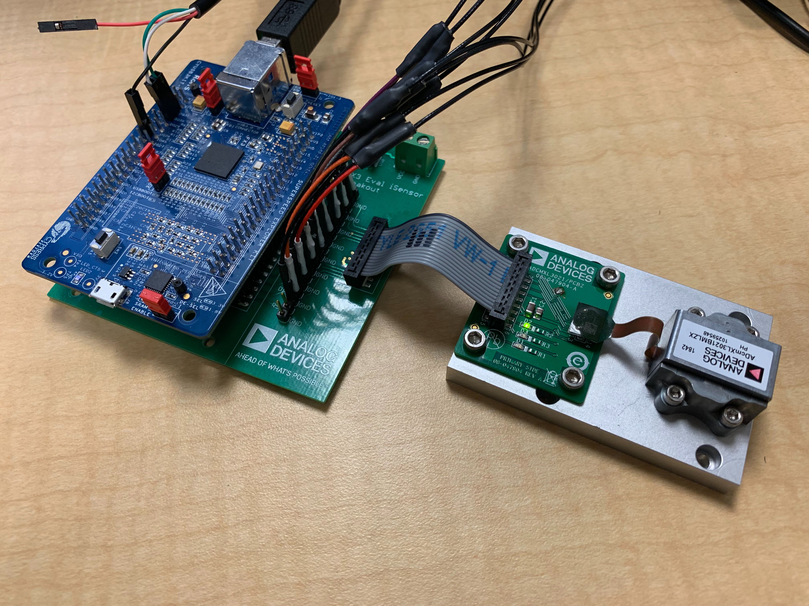

# iSensor FX3 Firmware

## Overview

The iSensor FX3 firmware is designed to provide users with a means of reliably acquiring sensor data over a high-speed USB connection in any .NET compatible application. This firmware was designed for use on the Cypress FX3 SuperSpeed Explorer Kit and relies on the open source libraries provided by Cypress to operate. The freely-available, Eclipse-based, Cypress EZ USB Suite was used for all firmware development. 

Doxygen generated documentation for the firmware can be found here: https://juchong.github.io/iSensor-FX3-Firmware/.

## System Architecture

The iSensor FX3 firmware attempts to follow the Cypress program workflow and relies on FX3 system threading, execution priority, and event flags to execute firmware subroutines and transmit sensor data. Unique vendor commands trigger subroutines embedded in the iSensor FX3 firmware that read and write SPI data, measure external pulses, generate clock signals, and manage board configuration. Different SPI streaming modes are implemented which allow applications to easily communicate to most products in the iSensor portfolio. 

A .NET-compatible API has been developed in parallel to simplify interfacing with the iSensor FX3 firmware. 

## Hardware Requirements

This firmware was designed using the Cypress SuperSpeed Explorer Kit (CYUSB3KIT-003), but should operate on a bare CYUSB3014 device assuming the correct hardware resources are externally available. 

Design files for a breakout board designed to adapt the Explorer Kit's pins to a standard, 16-pin, 2mm connector used on most iSensor evaluation boards is available in the [hardware](https://github.com/juchong/iSensor-FX3-Firmware/tree/master/hardware) folder of this repository. 

## Jumper Configuration

The Explorer Kit requires two jumpers to be installed to operate correctly. Jumpers J2 and J3 enable an onboard 3.3V regulator and set the correct power domain. Jumper J4 must be open to allow booting from flash. Circled jumpers (J2 and J3) in the image below should be populated, while the uncircled jumpers (J4 and J5) should be left open.

 

## Setting Up The Development Environment

#### Firmware Environment

This repository includes an eclipse `.project` file for each firmware which enables easily importing the necessary code and resources into the Cypress EZ USB Suite environment. The Cypress EZ USB Suite IDE can be found on Cypress' website [here](https://www.cypress.com/documentation/software-and-drivers/ez-usb-fx3-software-development-kit). Once downloaded and installed, open the `Cypress EZ USB Suite`, Select `File -> Import -> Existing Project Into Workplace` and select the `.project` file in this repository

#### .NET Environment

This firmware relies heavily on the accompanying FX3 API to implement many timing-sensitive vendor commands, data transfers, etc. As of v1.0.4, the firmware version number must match the FX3 API version number for any application to function. Additional details on setting up the API development and example application environments can be found in their respective repositories. 

## Drivers

As of v1.0.6, custom, signed, Analog Devices drivers must be used to communicate with the iSensor FX3 Firmware. The driver installation package can be found in the [drivers](https://github.com/juchong/iSensor-FX3-Firmware/tree/master/drivers) folder in this repository or downloaded directly from [here](https://github.com/juchong/iSensor-FX3-Firmware/raw/master/drivers/FX3DriverSetup.exe). 

## Supporting Repositories

The two repositories listed below were developed alongside this firmware and provide an easy way to implement iSensor FX3 Firmware features in a .NET application.

1. [iSensor FX3 API](https://github.com/juchong/iSensor-FX3-API)

2. [iSensor FX3 Example Gui](https://github.com/juchong/iSensor-FX3-ExampleGui)

## Debugging

Debugging on the Explorer Kit is done primarily through the UART port. Unfortunately, the onboard USB debugging connector utilizes the same FX3 GPIO pins as the SPI peripheral and will not properly function. To enable printing debugging messages, you'll need to use a USB->UART adapter [like this one](https://www.amazon.com/ADAFRUIT-Industries-954-Serial-Raspberry/dp/B00DJUHGHI/ref=sr_1_6?keywords=usb+uart&qid=1564080408&s=gateway&sr=8-6) to monitor GPIO 48 and 49 (labeled DQ30(RX) and DQ31(TX) on the Explorer Kit).  
