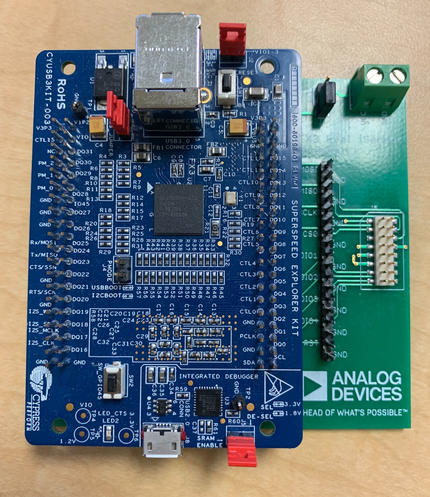

# iSensor FX3 Firmware

## Overview

The iSensor FX3 firmware is designed to provide users with a means of reliably acquiring sensor data over a high-speed USB connection in any .NET compatible application. This firmware was designed for use on the Cypress FX3 SuperSpeed Explorer Kit and relies on the open source libraries provided by Cypress to operate. The freely-available, Eclipse-based, Cypress EZ USB Suite was used for all firmware development. 

Doxygen generated documentation for the firmware can be found here: https://juchong.github.io/iSensor-FX3-API//firmware/docs/index.html.

## System Architecture

The iSensor FX3 firmware attempts to follow the Cypress program workflow and relies on FX3 system threading, execution priority, and event flags to execute firmware subroutines and transmit sensor data. Unique vendor commands trigger subroutines embedded in the iSensor FX3 firmware that read and write SPI data, measure external pulses, generate clock signals, and manage board configuration. Different SPI streaming modes are implemented which allow applications to easily communicate to most products in the iSensor portfolio. 

A .NET-compatible API has been developed in parallel to simplify interfacing with the iSensor FX3 firmware. 

## iSensor FX3 Evaluation Board

This firmware was designed around the Cypress EZ-USB FX3 SuperSpeed USB Controller (CYUSB3014 and CYUSB2014) family of USB interface ICs offered by Cypress. 

The next-generation FX3-based interface board now includes many additional firmware and hardware features that make testing, characterizing, and developing software for iSensor products easy. Firmware and API support for this board are included in release v2.5 onward. 

Some of the board's features include:

- Dedicated, onboard 3.3V, 2A regulator designed for high-transient applications
- USB-C connector
- Onboard, field-programmable EEPROM with USB bootloader fallback
- Software-selectable OFF / 3.3V / 5V sensor supply output with overcurrent and short protection
- JST-XH-2 external supply connector
- iSensor standard, 16-pin, 2mm connector for compatibility with most iSensor breakout boards and adapters
- Additional 10-pin, 2mm connector for feature expansion. The current firmware and API include support for:
  - FX3 UART debugging
  - Four GPIO for external test equipment triggering and sensing
  - Internal 3.3V and 5V supplies are broken out separately from the DUT supply to power external level shifters, interface ICs, etc.
  - An extra "bit-banged" SPI port to allow for "exotic" SPI configurations and communication with external hardware (ADCs, DACs, protocol interface ICs, etc.)
- Multi-board data capture capability. Multiple boards can be connected to the same PC and can concurrently capture data independently of each other
- Very low CPU usage while capturing data, even on older Windows machines
- 1.5" x 1.75" PCB footprint

Design files for the breakout board is available in the [hardware](https://github.com/juchong/iSensor-FX3-API/tree/master/hardware) folder of this repository. 

## SuperSpeed Explorer Kit Breakout Board

A breakout board designed for interfacing iSensor devices with the Cypress SuperSpeed Explorer Kit (CYUSB3KIT-003) was introduced as a temporary solution while a more feature-rich offering was developed.  Both boards will continue to be supported in future firmware revisions. 

Design files for both breakout boards are available in the [hardware](https://github.com/juchong/iSensor-FX3-API/tree/master/hardware) folder of this repository. 

## SuperSpeed Explorer Kit Jumper Configuration

The Explorer Kit requires **three** jumpers to be installed to operate correctly as shown in the image below. **Jumpers J2, J3, and J5 must be installed** when using the SuperSpeed Explorer Kit. **Jumper J4 must be open** to allow booting from the onboard EEPROM. 

 

## Setting Up The Development Environment

#### Firmware Environment

This repository includes an eclipse `.project` file for each firmware which enables easily importing the necessary code and resources into the Cypress EZ USB Suite environment. The Cypress EZ USB Suite IDE can be found on Cypress' website [here](https://www.cypress.com/documentation/software-and-drivers/ez-usb-fx3-software-development-kit). Once downloaded and installed, open the `Cypress EZ USB Suite`, Select `File -> Import -> Existing Project Into Workplace` and select the `.project` file in this repository

#### .NET Environment

This firmware relies heavily on the accompanying FX3 API to implement many timing-sensitive vendor commands, data transfers, etc. As of v1.0.4, the firmware version number must match the FX3 API version number for any application to function. Additional details on setting up the API development and example application environments can be found in their respective repositories. 

## Drivers

As of v1.0.6, custom, signed, Analog Devices drivers must be used to communicate with the iSensor FX3 Firmware. The driver installation package can be found in the [drivers](https://github.com/juchong/iSensor-FX3-API/tree/master/drivers) folder in this repository or downloaded directly from [here](https://github.com/juchong/iSensor-FX3-API/raw/master/drivers/FX3DriverSetup.exe). 

## Debugging

Debugging on the Explorer Kit is done primarily through the UART port. Unfortunately, the onboard USB debugging connector utilizes the same FX3 GPIO pins as the SPI peripheral and will not properly function. To enable printing debugging messages, you'll need to use a USB->UART adapter [like this one](https://www.amazon.com/ADAFRUIT-Industries-954-Serial-Raspberry/dp/B00DJUHGHI/ref=sr_1_6?keywords=usb+uart&qid=1564080408&s=gateway&sr=8-6) to monitor GPIO 48 and 49 (labeled DQ30(RX) and DQ31(TX) on the Explorer Kit).  
